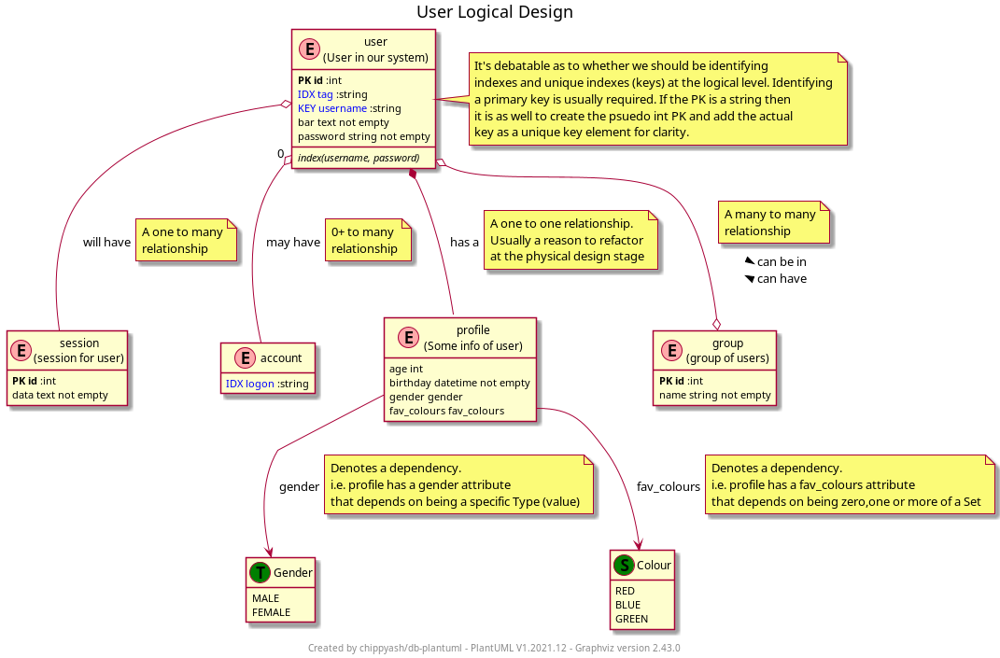
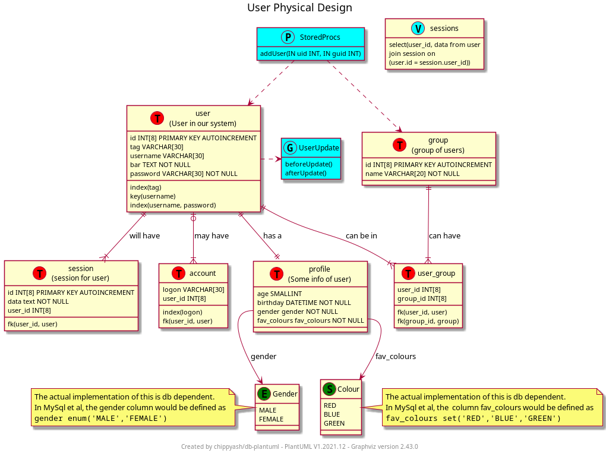

# PlantUML Database Support
## chippyash/db-plantuml

### What

1. Provides Plantuml !include files that you can use to create
logical and physical database diagrams
2. Provides a (PHP) utility to turn the diagrams into DDL files to create
your database (coming soon!)

## PlantUml Support

2 definition files
 - DatabaseLogical.iuml
 - DatabasePhysical.iuml

### Goal
To quickly create logical db designs that end users might understand
and convert them to initial physical designs with additional functionality
so they can quickly turned into something developers will understand.

### Demo

 - Open `examples\User-Logical.puml` and display the drawing
 - Open `examples\User-Physical.puml` and display the drawing

Look at both files. The only difference between them is
 - a/ the included file defined at top of definition
 - b/ physical drawing has additional features
    - View
    - Trigger & trigger()
    - (Stored) Proc and uses()

The original logical definition was copy-pasta'd from the logical file
to the physical file and renders automatically in physical form.

Take a look at the `dist\*.iuml` files. It's the subtle differences between the
function declations that allows the transform to happen.

### Installation
There is no real need to install this code base. You can access the
required files remotely using the `!includeurl` directive.

_You do however, need to install [PlantUml](http://plantuml.com/)_!

### Usage
1. Create your logical model to represent customer/user view
2. Copy logical model file to physical model file and change the !include
statement. Amend as necessary.
3. (Optional) Generate the SQL DDL file to create your database

**NB. This project is still in alpha stage. Whilst changes to the available Puml commands
will remain largely stable, there may be small changes in order to facilitate the 
generation of SQL DDL which is currently ongoing**

#### Logical Models
`!include ../dist/DatabaseLogical.iuml`

or

`!includeurl https://raw.githubusercontent.com/chippyash/db-plantuml/master/dist/DatabaseLogical.iuml`


Logical model will display the following differently to their representation
in a Physical model
##### Components
```
Table(alias, name="", description="")  //preferred
or 
Entity(alias, name="", description="") //psuedonym for Table

Type(alias, name="", description="")   //data type (enum)

Set(alias, name="", description="")    //data type (set)
```
##### Data types
```
string(l=30)
text()
date()
time()
datetime()
int(l=8)
real()
bool()
```
NB string and int lengths do not display in logical models, but specify
them if you know them as they will be displayed in physical models.

You can display other data types directly in your entity classes e.g.
```
Table(t1, foo) {
    bin_data blob
}
```
##### Type modifiers
```
not_null(x, t)
```
##### Indexes and keys
```
primary(name = 'id', type=int(), auto=1)  //primary key
idx(name, type=int())    //non unique index - one member
idx2(name1, name2)         //non unique index - two members
idx3(name1, name2, name3)  //non unique index - three members
```
##### Relationships
```
zeromany(from, to, verb, tNum='n')
onemany(from, to, verb, tNum='n')
manymany(from, to, verbFrom, verbTo)
oneone(from, to, verb, keyname='id', type=int())
depends(from, to, verb)
```
There is an internal relationship `_join`
```
_join(from, to, verb, fNum, tNum)
e.g.
_join(a, b, has, 0, n)
```
You can use this to fine tune relationships as required. fNum & tNum accept an integer
or 'n'.

#### Physicals Models
`!include ../dist/DatabasePhysical.iuml`

or

`!includeurl https://raw.githubusercontent.com/chippyash/db-plantuml/master/dist/DatabasePhysical.iuml`



Use the same statements as per Logical models. In addition there are:
##### Components
```
Trigger(alias, name)
e.g.
Trigger(t1, UserUpdate) {
    beforeUpdate()
    afterUpdate()
}

Proc(alias, name)
e.g.
Proc(p1, StoredProcs) {
    addUser(uid, guid)
}

View(alias, name)
e.g.
View(v1, sessions) {
    select(user_id, data\nfrom user, session\njoin id on user_id)
}
```
##### Indexes and keys
```
foreign_key(tableName, to, type=int(), suffix='_id')
```
Foreign keys are automatically generated where appropriate between Tables
in your model. You may need to explicitly declare them for Tables that are off model.

##### Relationships
```
function triggers(from, to)  //table actions trigger
function uses(from, to)      //proc uses table
```
These relationships are purely informational.

## Diagram to SQL conversion

**Coming Soon!**

example command to generate xml
`java -jar "C:/Program Files/Java/jars/plantuml.jar" -txmi:star .\examples\User-Physical.puml`

## License
This software is licensed under the [BSD-3 Clause license](LICENSE.md).

## To Do
 - complete the DDL generation tool
